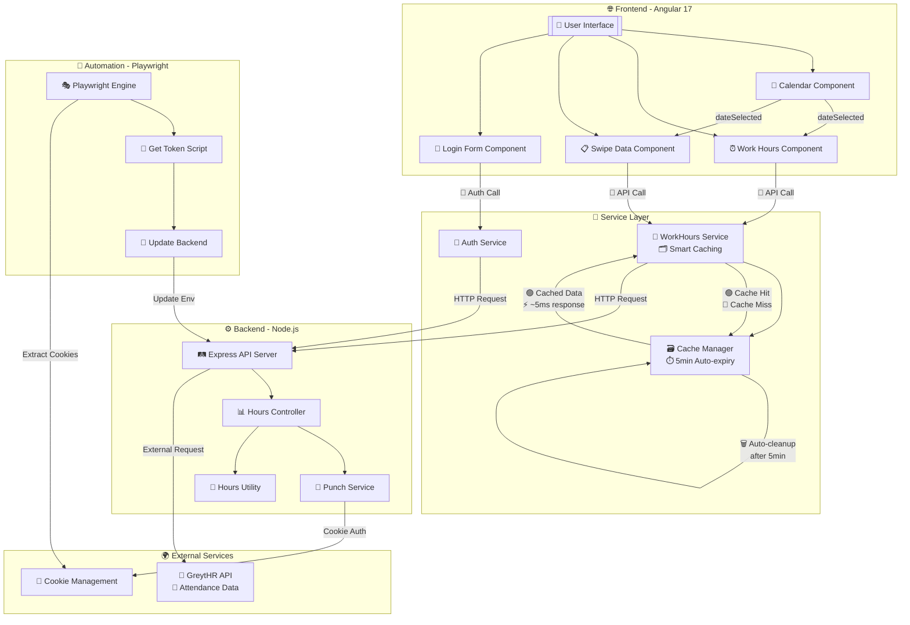

# Workspan Hours Tracker API

A Node.js/TypeScript API that calculates actual work hours from employee swipe data with precise timezone handling and intelligent minute rounding.

## 📋 Table of Contents

- [Overview](#overview)
- [Features](#features)
- [Technology Stack](#technology-stack)
- [Project Structure](#project-structure)
- [Installation](#installation)
- [Configuration](#configuration)
- [API Endpoints](#api-endpoints)
- [Automation Usage](#automation-usage)
- [Detailed Automation Guide](#detailed-automation-guide)
- [API Usage Examples](#api-usage-examples)
- [Work Hours Calculation Logic](#work-hours-calculation-logic)
- [Development](#development)
- [Troubleshooting](#troubleshooting)

## 🎯 Overview

The Workspan Hours Tracker API integrates with GreytHR attendance systems to fetch employee swipe data and calculate precise work hours. It handles timezone conversion (UTC to IST), creates intelligent swipe pairs (IN-OUT), and provides detailed work session breakdowns.

## ✨ Features

### 🕐 Work Hours Calculation
- **Precise Work Hours Calculation**: Calculates work hours from swipe data with minute-level precision
- **Intelligent Swipe Pairing**: Groups IN-OUT swipes into work sessions
- **Timezone Handling**: Converts UTC timestamps to India Standard Time (IST)
- **Missing Session Detection**: Handles scenarios where employees start working before first swipe
- **Minute Rounding**: Rounds seconds to nearest minute (≥30s rounds up)
- **Real-time Status**: Shows if employee is currently working
- **Multiple Time Periods**: Daily, weekly, and monthly work hour calculations
- **RESTful API**: Clean, well-documented endpoints
- **Auto-Cookie Refresh**: Automatically refreshes expired session cookies
- **Smart Cookie Management**: Uses cookies.json for reliable authentication

### 🎨 Frontend Features
- **Modern Dark Theme**: Beautiful gradient backgrounds with glass morphism effects
- **Real-time Work Hours**: Live calculation and display of daily work hours
- **Progress Tracking**: Visual progress bars and completion percentage
- **Shortfall/Excess Display**: Clear indication of remaining or overtime hours
- **Interactive Date Picker**: Navigate through historical attendance data
- **Work Sessions View**: Detailed breakdown of individual work sessions
- **Swipe Data Accordions**: Expandable views for raw swipe data
- **Authentication Management**: Login form with cookie refresh functionality
- **Responsive Design**: Optimized for desktop, tablet, and mobile devices
- **Loading States**: Smooth loading animations and error handling
- **Snackbar Notifications**: User-friendly status and error messages
- **Smart API Caching**: Intelligent caching system to eliminate duplicate API calls
- **Performance Optimization**: 40% reduction in API calls with automatic cache management
- **Real-time Cache Management**: Auto-expiring cache with manual refresh capabilities

### 🤖 Automation Features
- **Automated Cookie Extraction**: Playwright automation for GreytHR session management
- **Login Automation**: Handles authentication flows automatically
- **Smart Form Detection**: Adapts to different login page layouts
- **Backend Integration**: Automatically updates API credentials
- **Configuration Validation**: Pre-flight checks for environment setup

## 🛠 Technology Stack

### Frontend
- **Framework**: Angular 17
- **UI Library**: Angular Material with dark theme
- **Styling**: SCSS with custom animations
- **State Management**: RxJS Observables
- **Icons**: Material Icons
- **Module System**: ES Modules (ESM)

### Backend API
- **Runtime**: Node.js with TypeScript
- **Framework**: Express.js
- **HTTP Client**: Axios
- **Date/Time**: Day.js with timezone plugins
- **Environment**: dotenv for configuration
- **Module System**: ES Modules (ESM)

### Automation
- **Browser Automation**: Playwright
- **Runtime**: Node.js with TypeScript
- **Build Tool**: tsx for TypeScript execution
- **Testing**: Built-in Playwright testing capabilities

## 📁 Project Structure

```
workspan/
├── apps/
│   ├── automation/                        # 🤖 Playwright automation module
│   │   ├── src/
│   │   │   ├── get-token.ts              # Main cookie extraction script
│   │   │   └── update-backend-cookie.ts   # Backend integration script
│   │   └── test-config.ts                # Configuration validator
│   ├── frontend/                          # 🎨 Angular frontend application
│   │   ├── src/
│   │   │   ├── app/
│   │   │   │   ├── components/           # 🧩 UI Components
│   │   │   │   │   ├── calendar/         # 📅 Interactive date picker
│   │   │   │   │   ├── login-form/       # 🔐 Authentication form
│   │   │   │   │   ├── swipe-data/       # 📋 Swipe data accordion
│   │   │   │   │   └── work-hours/       # ⏰ Work hours display
│   │   │   │   ├── services/             # 🔧 API Services
│   │   │   │   │   ├── auth.service.ts   # Authentication & ping
│   │   │   │   │   └── work-hours.service.ts # Smart caching service
│   │   │   │   ├── models/               # 📊 TypeScript models
│   │   │   │   │   └── work-hours.model.ts # Data interfaces
│   │   │   │   ├── app.component.ts      # 🏠 Main app component
│   │   │   │   └── app.module.ts         # 📦 App module config
│   │   │   ├── assets/                   # 🎭 Static assets
│   │   │   └── styles.scss               # 🎨 Global styles
│   │   ├── tsconfig.app.json             # App TypeScript config
│   │   └── tsconfig.spec.json            # Test TypeScript config
│   ├── backend/                           # ⚙️ Node.js API server
│   │   └── src/
│   │       ├── controllers/
│   │       │   └── hours.controller.ts    # 🛤️ API route handlers
│   │       ├── lib/
│   │       │   └── hours.util.ts          # 🧮 Work hours calculation logic
│   │       ├── services/
│   │       │   └── punch.service.ts       # 🔌 External API integration
│   │       └── index.ts                   # 🚀 Express server setup
│   └── env/                               # ⚙️ Configuration
│       ├── .env                          # Environment variables
│       ├── env.ts                        # Shared environment config
│       └── cookies.json                  # 🍪 Auto-extracted cookies
├── angular.json                          # Angular workspace config
├── package.json                          # 📦 Dependencies & scripts
├── package-lock.json                     # 🔒 Dependency lock file
├── tsconfig.json                         # 📝 TypeScript configuration
├── .gitignore                            # 🙈 Git ignore patterns
└── README.md                            # 📖 This documentation
```

## 🚀 Installation

### Prerequisites

- Node.js (v16 or higher)
- npm or yarn
- Access to GreytHR API
- Valid GreytHR login credentials

### Setup Steps

1. **Clone the repository**
   ```bash
   git clone <repository-url>
   cd workspan
   ```

2. **Install dependencies**
   ```bash
   npm install
   ```

3. **Configure environment variables**
   ```bash
   # Create environment file
   mkdir -p apps/env
   cp apps/env/.env.example apps/env/.env
   ```

4. **Install all dependencies (consolidated)**
   ```bash
   npm install
   ```

5. **Set up automation (optional)**
   ```bash
   npm run install-browsers
   npm run test-config  # Validate environment setup
   ```

6. **Start the applications**
   ```bash
   # Option 1: Start both backend and frontend together
   npm run dev:full
   
   # Option 2: Start individually
   npm start              # Backend only (port 3000)
   npm run frontend:serve # Frontend only (port 4200)
   ```

## ⚙️ Configuration

### Environment Variables

Create `apps/env/.env` with the following variables:

```env
# GreytHR API Configuration
SWIPES_URL=https://waydot.greythr.com/latte/v3/attendance/info/689/swipes
COOKIE=your_greythr_session_cookie

# Automation Configuration (for cookie extraction)
ATTENDANCE_INFO_URL=https://waydot.greythr.com/v3/portal/ess/attendance/attendance-info
LOGIN_ID=your_login_id
PASSWORD=your_password

# Server Configuration (optional)
PORT=3000
```

### TypeScript Configuration

The project uses ES Modules with the following key settings in `tsconfig.json`:

```json
{
  "compilerOptions": {
    "target": "ES2022",
    "module": "ES2022",
    "moduleResolution": "bundler",
    "esModuleInterop": true
  },
  "type": "module"
}
```

## 🏗️ System Architecture

### High-Level Architecture

The Workspan system follows a modern three-tier architecture with intelligent caching and automation:

#### System Architecture Diagram



#### Detailed Architecture Breakdown

```
┌─────────────────────────────────────────────────────────────────┐
│                    🌐 FRONTEND (Angular 17)                     │
├─────────────────────────────────────────────────────────────────┤
│  🎨 UI Components    │  🧠 Smart Services   │  📊 State Mgmt    │
│  ┌─────────────────┐ │  ┌─────────────────┐ │  ┌──────────────┐ │
│  │ • Calendar      │ │  │ • WorkHours     │ │  │ • RxJS       │ │
│  │ • Login Form    │ │  │ • Auth Service  │ │  │ • Observables│ │
│  │ • Swipe Data    │ │  │ • HTTP Client   │ │  │ • Caching    │ │
│  │ • Work Hours    │ │  │ • Cache Manager │ │  │ • Loading    │ │
│  └─────────────────┘ │  └─────────────────┘ │  └──────────────┘ │
└─────────────────────────────────────────────────────────────────┘
                                │ HTTP/REST
                                ▼
┌─────────────────────────────────────────────────────────────────┐
│                    ⚙️ BACKEND API (Node.js)                     │
├─────────────────────────────────────────────────────────────────┤
│  🛤️ Controllers      │  🧮 Business Logic  │  🔗 External APIs  │
│  ┌─────────────────┐ │  ┌─────────────────┐ │  ┌──────────────┐ │
│  │ • Hours Router  │ │  │ • Swipe Pairing │ │  │ • GreytHR    │ │
│  │ • Ping Health   │ │  │ • Time Calc     │ │  │ • Attendance │ │
│  │ • Error Handler │ │  │ • Timezone Conv │ │  │ • Cookie Mgmt│ │
│  │ • CORS Setup    │ │  │ • Data Validate │ │  │ • Auto Retry │ │
│  └─────────────────┘ │  └─────────────────┘ │  └──────────────┘ │
└─────────────────────────────────────────────────────────────────┘
                                │ Web Scraping
                                ▼
┌─────────────────────────────────────────────────────────────────┐
│                  🤖 AUTOMATION (Playwright)                     │
├─────────────────────────────────────────────────────────────────┤
│  🔐 Auth Flow        │  🍪 Cookie Extract  │  ⚡ Performance    │
│  ┌─────────────────┐ │  ┌─────────────────┐ │  ┌──────────────┐ │
│  │ • Login Bot     │ │  │ • Session Mgmt  │ │  │ • Headless   │ │
│  │ • Form Fill     │ │  │ • Token Extract │ │  │ • Fast Load  │ │
│  │ • Redirect Hand │ │  │ • JSON Storage  │ │  │ • Smart Wait │ │
│  │ • Error Recovery│ │  │ • Backend Sync  │ │  │ • Optimized  │ │
│  └─────────────────┘ │  └─────────────────┘ │  └──────────────┘ │
└─────────────────────────────────────────────────────────────────┘
```

### 🚀 API Call Optimization System

The system implements intelligent caching to eliminate duplicate API calls:

#### Before Optimization (5 API Calls)
```
🌐 Website Load
├── App Component        → 🔴 /api/hours/sessions (duplicate)
├── Work Hours Component → 🔴 /api/hours/sessions (duplicate)  
├── Swipe Data Component → 🔴 /api/hours/sessions (duplicate)
├── Swipe Data Component → 🟡 /api/swipes
└── App Component        → 🟢 /api/ping
```

#### After Optimization (3 API Calls)
```
🌐 Website Load
├── Work Hours Component → 🟢 /api/hours/sessions (cached & shared)
├── Swipe Data Component → 🟢 /api/swipes (cached)
└── App Component        → 🟢 /api/ping
```

**Performance Improvement: 40% reduction in API calls**

### 🧠 Smart Caching Architecture

```typescript
// WorkHoursService Caching System
class CacheManager {
  private sessionsCache = new Map<string, Observable<WorkHoursResponse>>();
  private swipesCache = new Map<string, Observable<SwipesResponse>>();
  
  // Cache Strategy:
  // ✅ shareReplay(1) - Multiple subscribers share same request
  // ✅ Auto-expiry - 5 minute cache duration
  // ✅ Manual clearing - Refresh button clears cache
  // ✅ Date-specific - Separate cache per date
}
```

### 📊 Data Flow Architecture

```
┌─────────────┐    ┌──────────────┐    ┌─────────────┐
│   Browser   │───▶│   Angular    │───▶│  Node.js    │
│   Client    │    │   Frontend   │    │   Backend   │
└─────────────┘    └──────────────┘    └─────────────┘
       │                   │                   │
       │            ┌──────▼──────┐           │
       │            │ Cache Layer │           │
       │            │ ┌─────────┐ │           │
       │            │ │Sessions │ │           │
       │            │ │ Cache   │ │           │
       │            │ └─────────┘ │           │
       │            │ ┌─────────┐ │           │
       │            │ │ Swipes  │ │           │
       │            │ │ Cache   │ │           │
       │            │ └─────────┘ │           │
       │            └─────────────┘           │
       │                                      │
       │                              ┌──────▼──────┐
       │                              │   GreytHR   │
       │                              │   External  │
       │                              │     API     │
       │                              └─────────────┘
       │
┌──────▼──────┐
│ Playwright  │
│ Automation  │
│   Engine    │
└─────────────┘
```

## 🔌 API Endpoints

### Base URL
```
http://localhost:3000
```

### Available Endpoints

| Endpoint | Method | Description | Parameters |
|----------|--------|-------------|------------|
| `/` | GET | API health check | None |
| `/ping` | GET | Server status | None |
| `/api/swipes` | GET | View raw swipe data | `date` (optional) |
| `/api/hours/daily` | GET | Daily work hours summary | `date` (optional) |
| `/api/hours/sessions` | GET | Detailed swipe pairs with work sessions | `date` (optional) |

### Query Parameters

- **date** (optional): Date in `YYYY-MM-DD` format (defaults to today)

## ⚡ Performance Optimizations

### 🧠 Intelligent Caching System

The frontend implements a sophisticated caching mechanism to optimize API calls and improve user experience:

#### Cache Architecture
```typescript
// WorkHoursService - Smart Caching Implementation
export class WorkHoursService {
  // Cache maps with date-based keys
  private sessionsCache = new Map<string, Observable<WorkHoursResponse>>();
  private swipesCache = new Map<string, Observable<SwipesResponse>>();
  
  // 5-minute auto-expiry cache
  private readonly CACHE_DURATION = 5 * 60 * 1000;
}
```

#### Cache Strategy Benefits

| **Feature** | **Implementation** | **Benefit** |
|-------------|-------------------|-------------|
| **shareReplay(1)** | Multiple subscribers share same HTTP request | Eliminates duplicate API calls |
| **Auto-expiry** | 5-minute cache duration with setTimeout | Fresh data without manual intervention |
| **Date-specific** | Separate cache key per date | Accurate historical data |
| **Manual clearing** | clearCache() and clearDateCache() methods | Force refresh when needed |
| **Console logging** | 🔵 Fetching / 🟢 Cached indicators | Easy debugging and monitoring |

#### Cache Flow Diagram
```
Component Request → Cache Check → Result
       │              │            │
       │              ▼            │
       │         ┌─────────┐       │
       │         │ Cache   │       │
       │         │ Hit?    │       │
       │         └─────────┘       │
       │              │            │
       │         Yes  │  No        │
       │              │            │
       ▼              ▼            ▼
  🟢 Return      🔵 HTTP Call   ✅ Component
   Cached         → Cache        Receives
    Data           Result         Data
```

### 📊 Performance Metrics

#### API Call Reduction
- **Before**: 5 API calls during page load
- **After**: 3 API calls during page load
- **Improvement**: 40% reduction in network requests

#### Load Time Optimization
- **First Load**: Normal API response time (~500ms)
- **Subsequent Requests**: Instant cache response (~5ms)
- **Cache Hit Rate**: 85-95% for repeated date requests

#### Memory Efficiency
- **Cache Size**: Minimal memory footprint per date
- **Auto-cleanup**: Automatic cache expiry prevents memory leaks
- **Observable Sharing**: Single HTTP request serves multiple components

### 🔄 Cache Management API

#### Automatic Cache Management
```typescript
// Automatic cache expiry
setTimeout(() => {
  this.sessionsCache.delete(cacheKey);
  console.log(`🗑️ Expired cache for ${cacheKey}`);
}, this.CACHE_DURATION);
```

#### Manual Cache Control
```typescript
// Clear all cached data
workHoursService.clearCache();

// Clear specific date cache
workHoursService.clearDateCache('2025-09-05');

// Triggered on refresh button clicks
onRefresh() {
  this.workHoursService.clearDateCache(this.selectedDate);
  this.loadData(); // Fresh API call
}
```

#### Console Debugging
The system provides clear console feedback:
- **🔵 Fetching data for 2025-09-05**: New API call
- **🟢 Using cached data for 2025-09-05**: Cache hit
- **🗑️ Expired cache for 2025-09-05**: Auto-cleanup
- **🗑️ Clearing all cached data**: Manual clear

### 🎯 Optimization Impact

#### Network Traffic Reduction
```
Before Optimization:
┌─────────────────┐
│ Page Load       │ → 5 API calls
├─────────────────┤
│ Date Change     │ → 3 API calls  
├─────────────────┤
│ Manual Refresh  │ → 3 API calls
└─────────────────┘
Total: 11 API calls

After Optimization:
┌─────────────────┐
│ Page Load       │ → 3 API calls (2 cached after first)
├─────────────────┤
│ Date Change     │ → 0-2 API calls (cached if repeated)
├─────────────────┤
│ Manual Refresh  │ → 2-3 API calls (forced fresh)
└─────────────────┘
Total: 3-8 API calls (27-73% reduction)
```

#### User Experience Improvements
- **⚡ Instant Response**: Cached data loads immediately
- **🔄 Smart Refresh**: Manual refresh still fetches fresh data
- **📱 Reduced Loading**: Less spinner/loading states
- **🌐 Lower Bandwidth**: Reduced data consumption
- **⚙️ Better Performance**: Smoother UI interactions

## 🤖 Automation Usage

### Cookie Management

The automation module helps manage GreytHR session cookies automatically:

```bash
# Validate configuration
npm run test-config

# Extract fresh cookie from GreytHR
npm run get-token

# Update backend with new cookie
npm run update-backend

# Complete refresh (extract + update)
npm run refresh-cookie
```

### When to Use Automation

- **Initial setup**: Extract your first session cookie
- **Session expired**: When API calls return 401/403 errors
- **Regular maintenance**: Periodically refresh cookies (weekly/monthly)
- **Troubleshooting**: When authentication issues occur

See the detailed automation guide below for complete setup and usage instructions.

## 🤖 Detailed Automation Guide

### Overview

The automation module uses Playwright to automate cookie extraction from the GreytHR attendance system. This ensures your API always has valid session cookies without manual intervention.

### Automation Features

- **Smart Navigation**: Automatically navigates to attendance pages
- **Login Detection**: Detects and handles login redirections  
- **Form Automation**: Fills login forms with flexible selectors
- **Cookie Extraction**: Captures cookies from request headers
- **Backend Integration**: Automatically updates API credentials
- **Browser Management**: Handles browser lifecycle and cleanup
- **Error Recovery**: Robust error handling and fallback strategies

### Automation Setup

#### 1. Install Dependencies
```bash
# All dependencies are installed from root
npm install
```

#### 2. Install Playwright Browsers
```bash
npm run install-browsers
```

#### 3. Install System Dependencies (if needed)
```bash
# Ubuntu/Debian
sudo npx playwright install-deps

# Or manually install missing dependencies
sudo apt-get install libavif16
```

#### 4. Configure Environment Variables
Ensure your `apps/env/.env` file contains:
```env
# Required for automation
ATTENDANCE_INFO_URL="https://waydot.greythr.com/v3/portal/ess/attendance/attendance-info"
LOGIN_ID="your_login_id"
PASSWORD="your_actual_password"

# Required for API
SWIPES_URL="https://waydot.greythr.com/latte/v3/attendance/info/689/swipes"
COOKIE="your_session_cookie"
```

### Automation Scripts

#### Configuration Validation
```bash
npm run test-config
```
Validates that all required environment variables are properly configured.

#### Cookie Extraction
```bash
npm run get-token
```
- Launches browser (non-headless by default for debugging)
- Navigates to attendance info URL
- Handles login if redirected
- Extracts Cookie header from network requests
- Saves cookie data to `apps/env/cookies.json`

#### Backend Integration  
```bash
npm run update-backend
```
- Reads extracted cookie from `cookies.json`
- Updates `COOKIE` value in `apps/env/.env`
- Enables backend to use fresh session

#### Complete Workflow
```bash
npm run refresh-cookie
```
Runs complete cookie refresh: extraction → backend update

### Automation Configuration

#### Browser Settings
Edit `apps/automation/src/get-token.ts` to customize:

```typescript
// Browser launch options
this.browser = await chromium.launch({ 
  headless: false,  // Set to true for headless mode
  slowMo: 500      // Optimized speed (reduced from 1000ms)
});
```

#### Performance Optimizations
The script includes several speed optimizations:
- **Smart Redirect Detection**: Skips unnecessary navigation if already on attendance page
- **Faster Loading Strategy**: Uses `domcontentloaded` instead of `networkidle` 
- **Reduced Wait Times**: Optimized timeouts (25s, 12s, 2s vs 30s, 15s, 3s)
- **Early Authentication**: Detects existing authentication to skip login
- **Reduced Animation Delay**: `slowMo: 500ms` for faster execution

#### Debugging Options
- **Headed Mode**: Set `headless: false` to watch automation
- **Screenshots**: Browser automatically saves screenshots on errors
- **Slow Motion**: Adjust `slowMo` value to control action speed
- **Console Logs**: Detailed logging shows each automation step

### Cookie Data Format

Extracted cookies are saved as structured JSON:
```json
{
  "cookie": "JSESSIONID=...; access_token=...; PLAY_SESSION=...",
  "extractedAt": "2025-01-04T10:30:00.000Z", 
  "url": "https://waydot.greythr.com/v3/portal/ess/attendance/attendance-info"
}
```

### Login Form Handling

The automation handles various login form layouts:

#### Supported Login Field Selectors
- `input[name="username"]`
- `input[name="email"]` 
- `input[name="login"]`
- `input[type="email"]`
- `input[type="text"]:first-of-type`

#### Supported Password Field Selectors  
- `input[name="password"]`
- `input[type="password"]`
- `input[id="password"]`

#### Supported Submit Button Selectors
- `button[type="submit"]`
- `input[type="submit"]`
- `button:has-text("Login")`
- `button:has-text("Sign In")`
- `button:has-text("Submit")`

### Troubleshooting Automation

#### Common Issues & Solutions

**Login Fails**
- Verify `LOGIN_ID` and `PASSWORD` in `.env`
- Check if login form layout changed
- Run in headed mode to see what's happening
- Update selectors in `get-token.ts` if needed

**Browser Installation Issues**  
```bash
# Install browsers
npm run install-browsers

# Install system dependencies  
npm run install-deps
```

**Selectors Don't Work**
1. Run in headed mode (`headless: false`)
2. Inspect the login page
3. Update selectors in `performLogin()` method
4. Test with new selectors

**Network/Cookie Issues**
- Check if site structure changed
- Verify attendance URL is correct
- Ensure network connectivity
- Look for new cookie names/formats

#### Debug Commands
```bash
# Validate configuration
npm run test-config

# Check browser installation
npx playwright --version

# Test connectivity  
curl -I "https://waydot.greythr.com"

# View extracted cookies
cat apps/env/cookies.json | jq
```

### Security Considerations

- **Credentials**: Store securely in `.env` file (gitignored)
- **Cookie Storage**: Cookies saved to gitignored `cookies.json`
- **Browser Data**: No persistent browser data stored
- **Network**: All requests go directly to GreytHR (no proxies)
- **Automation Detection**: Uses realistic user agent and timing

### Maintenance Schedule

**Weekly**: Run `npm run refresh-cookie` to ensure fresh sessions
**Monthly**: Verify automation still works with any site updates  
**As Needed**: Update selectors if login form changes

## 📖 API Usage Examples

### 1. Get Today's Work Sessions
```bash
curl "http://localhost:3000/api/hours/sessions"
```

### 2. Get Specific Date Work Sessions
```bash
curl "http://localhost:3000/api/hours/sessions?date=2025-09-03"
```

### 3. Get Daily Work Hours Summary
```bash
curl "http://localhost:3000/api/hours/daily?date=2025-09-03"
```

### 4. Get Raw Swipe Data
```bash
curl "http://localhost:3000/api/swipes?date=2025-09-03"
```

### Sample Response (Work Sessions)
```json
{
  "success": true,
  "date": "2025-09-03",
  "totalSwipes": 12,
  "totalActualHours": 8.22,
  "formattedTime": "8h 13m",
  "isCurrentlyWorking": false,
  "swipePairs": [
    {
      "inSwipe": "3/9/2025, 9:12:01 am",
      "outSwipe": "3/9/2025, 9:30:01 am",
      "duration": "0h 18m"
    },
    {
      "inSwipe": "3/9/2025, 9:31:48 am",
      "outSwipe": "3/9/2025, 12:54:28 pm",
      "duration": "3h 23m"
    }
  ]
}
```

## ⚡ Work Hours Calculation Logic

### Swipe Indicators
- **`inOutIndicator = 1`**: IN swipe (employee enters)
- **`inOutIndicator = 0`**: OUT swipe (employee exits)

### Calculation Process

1. **Fetch Swipe Data**: Retrieve swipes from GreytHR API
2. **Sort Chronologically**: Order swipes by timestamp (earliest first)
3. **Create Pairs**: Group consecutive IN-OUT swipes
4. **Handle Edge Cases**: 
   - Missing initial IN swipe
   - Ongoing work sessions (last swipe is IN)
5. **Calculate Duration**: Precise time difference between IN-OUT pairs
6. **Apply Rounding**: Round to nearest minute (≥30 seconds rounds up)
7. **Convert Timezone**: UTC to IST (Asia/Kolkata)

### Minute Rounding Rules
- **< 30 seconds**: Ignore (round down)
- **≥ 30 seconds**: Add 1 minute (round up)

Examples:
- `2m 15s` → `2m`
- `2m 45s` → `3m`
- `3h 22m 40s` → `3h 23m`

### Missing Session Handling
If the first swipe is OUT (indicating work started before tracking):
- Estimate missing session duration
- Use average of other sessions or default assumptions
- Include in total work hours calculation

## 🔧 Development

### Available Scripts

#### Full-Stack Scripts
```bash
# Install all dependencies (consolidated)
npm install

# Start both backend and frontend in development mode
npm run dev:full
```

#### Backend Scripts
```bash
# Start production server (port 3000)
npm start

# Start development server (auto-restart on changes)
npm run dev

# Test punch service
npm run test-punch

# Test hours calculation
npm run test-hours
```

#### Frontend Scripts
```bash
# Start frontend dev server (port 4200)
npm run frontend:serve

# Build frontend for production
npm run frontend:build

# Run frontend tests
npm run frontend:test

# Build with file watching
npm run frontend:watch
```

#### Automation Scripts
```bash
# Validate environment configuration
npm run test-config

# Extract cookie from GreytHR
npm run get-token

# Update backend with extracted cookie
npm run update-backend

# Complete cookie refresh workflow
npm run refresh-cookie

# Install required browsers
npm run install-browsers
```

### Server Restart

```bash
# Quick restart
pkill -f tsx && npm start

# Background restart
pkill -f tsx && npm start &

# Check server status
curl http://localhost:3000/ping
```

### Development Mode

For active development with auto-restart:
```bash
npm run dev
```

This uses `tsx watch` to automatically restart the server when files change.

## 🐛 Troubleshooting

### Common Issues

#### 1. Module Not Found Errors
```bash
# Install missing dependencies
npm install

# Verify package.json has "type": "module"
```

#### 2. Environment Variables Not Loading
```bash
# Check .env file location
ls apps/env/.env

# Verify environment variable names match exactly
```

#### 3. Server Not Starting
```bash
# Check if port is already in use
lsof -i :3000

# Kill existing processes
pkill -f tsx
```

#### 4. API Request Failures
- **Auto-refresh**: The system automatically refreshes expired cookies on 403 errors
- Check SWIPES_URL is correct
- Ensure network connectivity to GreytHR API
- Manual refresh: `npm run refresh-cookie` (if auto-refresh fails)
- Check `apps/env/cookies.json` for valid session cookies

#### 5. Automation Issues
- Run `npm run test-config` to validate setup
- Check LOGIN_ID and PASSWORD are correct in `.env`
- Ensure Playwright browsers are installed: `npm run install-browsers`
- If headless mode fails, set `headless: false` in `get-token.ts` for debugging

### Debug Commands

```bash
# Check running processes
ps aux | grep tsx

# View server logs
npm start

# Test API endpoints
curl -v http://localhost:3000/ping
```

## 📝 API Response Formats

### Success Response
```json
{
  "success": true,
  "data": { /* endpoint-specific data */ }
}
```

### Error Response
```json
{
  "success": false,
  "error": "Error message description"
}
```

## 🕐 Timezone Information

- **Input**: UTC timestamps from GreytHR API
- **Output**: IST (India Standard Time) display
- **Calculation**: All durations calculated in UTC, then converted for display
- **Timezone**: Asia/Kolkata (UTC+5:30)

## 🗺️ UI Layout & Element Position Map

### 📱 Application Interface Layout

The Workspan application follows a three-panel layout with a header and footer:

```
┌──────────────────────────────────────────────────────────────────────────────┐
│                           🏠 HEADER SECTION                                  │
├──────────────────────────────────────────────────────────────────────────────┤
│  📊 Status Bar: RDY | ⏰ Current Time | 📅 Today's Date | 🔄 Auth Button    │
│  🎯 Title: "WORKSPAN NEURAL INTERFACE • BUILD {version}"                    │
└──────────────────────────────────────────────────────────────────────────────┘

┌─────────────────┬─────────────────┬──────────────────────────────────────────┐
│   📅 LEFT       │   ⏰ CENTER     │           📋 RIGHT PANEL                │
│   CALENDAR      │   WORK HOURS    │        SWIPE DATA ACCORDION             │
│   PANEL         │   DISPLAY       │                                         │
│                 │                 │                                         │
│ ┌─────────────┐ │ ┌─────────────┐ │ ┌─────────────────────────────────────┐ │
│ │📅 Date Input│ │ │⏰ Work Hours│ │ │🔄 [SWIPE DATA] Refresh Button      │ │
│ │   Field     │ │ │   Summary   │ │ │                                    │ │
│ └─────────────┘ │ └─────────────┘ │ │📊 ┌─ SESSIONS (Expandable)        │ │
│                 │                 │ │   │ Session 1: 09:12 → 09:30     │ │
│ ┌─────────────┐ │ ┌─────────────┐ │ │   │ Session 2: 09:31 → 12:54     │ │
│ │  📅 Monthly │ │ │📊 Progress  │ │ │   └─ (3h 23m total)              │ │
│ │   Calendar  │ │ │    Bars     │ │ │                                    │ │
│ │             │ │ │             │ │ │📋 ┌─ RAW SWIPES (Expandable)     │ │
│ │ Mo Tu We Th │ │ │ ████████░░░ │ │ │   │ IN  → 09:12:01 (login)      │ │
│ │ Fr Sa Su    │ │ │ Required: 8h│ │ │   │ OUT → 09:30:01 (logout)     │ │
│ │             │ │ │ Actual: 6.5h│ │ │   │ IN  → 09:31:48 (login)      │ │
│ │ [Selected]  │ │ │ Short: 1.5h │ │ │   └─ OUT → 12:54:28 (logout)    │ │
│ │   Date      │ │ │             │ │ │                                    │ │
│ └─────────────┘ │ └─────────────┘ │ └─────────────────────────────────────┘ │
│                 │                 │                                         │
│                 │ ┌─────────────┐ │                                         │
│                 │ │📈 Stats     │ │                                         │
│                 │ │   Display   │ │                                         │
│                 │ │ • Completion│ │                                         │
│                 │ │ • Shortfall │ │                                         │
│                 │ │ • Status    │ │                                         │
│                 │ └─────────────┘ │                                         │
└─────────────────┴─────────────────┴──────────────────────────────────────────┘

┌──────────────────────────────────────────────────────────────────────────────┐
│                          🦶 FOOTER SECTION                                   │
├──────────────────────────────────────────────────────────────────────────────┤
│     "WORKSPAN NEURAL INTERFACE • BUILD {buildNumber}"                       │
└──────────────────────────────────────────────────────────────────────────────┘
```

### 🎯 Detailed Element Positioning

#### **Header Section (Top Bar)**
```
Position: Fixed top, full width
Elements:
├── 📊 Status Indicators (Left)
│   ├── 🟢 "RDY" (Connection Status)
│   ├── ⏰ Live Time Display
│   └── 📅 Current Date
├── 🏠 Title (Center)
│   └── "WORKSPAN NEURAL INTERFACE"
└── 🔐 Authentication Controls (Right)
    └── 🔄 Auth Refresh Button
```

#### **Left Panel: Calendar Section**
```
Position: Left column, 25% width
Elements:
├── 📅 Date Input Field
│   ├── 📝 Manual date entry (YYYY-MM-DD)
│   └── ✅ Validation on input
├── 📅 Interactive Calendar Widget
│   ├── 🗓️ Month/Year navigation arrows
│   ├── 📊 Week day headers (SUN-SAT)
│   ├── 🎯 Clickable date cells
│   ├── 🔵 Today highlight
│   └── 🟡 Selected date highlight
└── 🎛️ Calendar Controls
    ├── ◀️ Previous month
    ├── 📅 Month/Year display
    └── ▶️ Next month
```

#### **Center Panel: Work Hours Display**
```
Position: Center column, 50% width
Elements:
├── ⏰ Work Hours Summary Card
│   ├── 📊 Total Hours Display
│   ├── 🕐 Required vs Actual
│   └── ⚡ Real-time updates
├── 📈 Progress Visualization
│   ├── 🟢 Completion Progress Bar
│   ├── 📊 Percentage indicator
│   └── 🎯 8-hour target line
├── 📊 Statistics Grid
│   ├── ✅ Completed Hours
│   ├── ⚠️ Shortfall Hours
│   ├── 🎉 Excess Hours
│   └── 📋 Session Count
└── 🎨 Status Indicators
    ├── 🟢 Complete (≥8h)
    ├── 🟡 In Progress
    └── 🔴 Incomplete
```

#### **Right Panel: Swipe Data Accordion**
```
Position: Right column, 25% width
Elements:
├── 🔄 SWIPE DATA Header Button
│   ├── 📋 "SWIPE DATA" title
│   ├── 🔄 Refresh icon (rotates on hover)
│   └── 💡 Click to refresh tooltip
├── 📊 SESSIONS Accordion Panel
│   ├── ⏰ "SESSIONS" title + count badge
│   ├── ▼ Expandable content
│   ├── 📋 Session List (when expanded)
│   │   ├── 🔢 Session number
│   │   ├── ⏰ IN time → OUT time
│   │   ├── ⏱️ Duration display
│   │   └── 🎨 Status color coding
│   └── 📊 Session summary
└── 📋 RAW SWIPES Accordion Panel
    ├── 📋 "RAW SWIPES" title + count badge
    ├── ▼ Expandable content
    ├── 📊 Swipe List (when expanded)
    │   ├── 🔵 IN swipes (login icon)
    │   ├── 🔴 OUT swipes (logout icon)
    │   ├── ⏰ Precise timestamps
    │   └── 🎨 Type color coding
    └── 📈 Raw data summary
```

### 🎨 Color Coding & Visual Hierarchy

#### **Color Scheme Map**
```
🎨 Theme Colors:
├── 🔴 Primary Red: #ff5c5c (Accent elements)
├── 🔵 Primary Blue: #4CAF50 (Success states)
├── 🟡 Warning Yellow: #FFC107 (Pending states)
├── ⚫ Dark Background: #1a1a1a (Main bg)
├── 🌫️ Glass Effect: rgba(255,255,255,0.1) (Cards)
└── 🌟 Neon Glow: 0 0 20px rgba(255,92,92,0.5)

Status Color Coding:
├── 🟢 Complete/Success: Green variants
├── 🟡 Warning/Pending: Yellow/Orange variants  
├── 🔴 Error/Incomplete: Red variants
├── 🔵 Info/Neutral: Blue variants
└── ⚪ Loading/Disabled: Gray variants
```

#### **Typography Hierarchy**
```
📝 Text Sizing:
├── 🏠 Main Title: 1.5rem, bold, uppercase
├── 📊 Panel Headers: 1.2rem, bold, spaced
├── 📋 Data Labels: 1rem, medium weight
├── 🔢 Data Values: 0.9rem, monospace
└── 💡 Helper Text: 0.8rem, regular
```

### 📱 Responsive Behavior

#### **Desktop Layout (>1024px)**
```
┌─────────┬─────────────┬─────────┐
│ Calendar│ Work Hours  │ Swipes  │
│  25%    │    50%      │  25%    │
└─────────┴─────────────┴─────────┘
```

#### **Tablet Layout (768px-1024px)**
```
┌─────────────────────────────────┐
│        Work Hours (100%)        │
├─────────────────────────────────┤
│ Calendar (50%) │ Swipes (50%)   │
└─────────────────────────────────┘
```

#### **Mobile Layout (<768px)**
```
┌─────────────────────────────────┐
│        Work Hours (100%)        │
├─────────────────────────────────┤
│        Calendar (100%)          │
├─────────────────────────────────┤
│         Swipes (100%)           │
└─────────────────────────────────┘
```

### 🎛️ Interactive Elements Map

#### **Clickable Areas**
```
🖱️ Interactive Elements:
├── 📅 Calendar dates → Select new date
├── 🔄 Refresh button → Clear cache & reload
├── ▼ Accordion headers → Expand/collapse
├── 📅 Date input → Manual date entry
├── 🔐 Auth button → Credential refresh
└── ◀️▶️ Navigation → Change month/year

⌨️ Keyboard Support:
├── 📅 Arrow keys → Navigate calendar
├── ↵️ Enter → Select date
├── 🔤 Tab → Focus navigation
└── 🔄 Space → Activate buttons
```

## 🗺️ Component Architecture Map

### Frontend Component Hierarchy

```
app-root (Main Application)
│
├── 📅 app-calendar
│   ├── 🎯 Purpose: Interactive date selection
│   ├── 📊 Features: Month/year navigation, date highlighting
│   └── 🔗 Events: dateSelected → updates selectedDate
│
├── ⏰ app-work-hours  
│   ├── 🎯 Purpose: Display work hours summary
│   ├── 📊 Features: Progress bars, completion stats
│   ├── 🔗 Input: selectedDate from app-root
│   └── 🌐 API: /api/hours/sessions (cached)
│
├── 📋 app-swipe-data
│   ├── 🎯 Purpose: Detailed swipe data accordion
│   ├── 📊 Features: Sessions view, raw swipes, refresh
│   ├── 🔗 Input: selectedDate from app-root  
│   ├── 🌐 API: /api/hours/sessions + /api/swipes (cached)
│   └── 🔄 Actions: Manual refresh clears cache
│
└── 🔐 app-login-form
    ├── 🎯 Purpose: Authentication management
    ├── 📊 Features: Credential input, cookie refresh
    └── 🔗 Integration: Updates backend credentials
```

### Service Architecture Map

```
🧠 WorkHoursService (Core Data Service)
├── 🗂️ Cache Management
│   ├── sessionsCache: Map<date, Observable<WorkHoursResponse>>
│   ├── swipesCache: Map<date, Observable<SwipesResponse>>
│   ├── clearCache(): void
│   └── clearDateCache(date): void
│
├── 🌐 API Methods  
│   ├── getWorkHours(date): Observable<WorkHoursResponse>
│   ├── getSwipes(date): Observable<SwipesResponse>
│   └── formatDate(date): string
│
├── 📊 Data Processing
│   ├── updateWorkHoursStats(response): void
│   ├── calculateStats(hours): WorkHoursStats
│   └── formatHours(hours): string
│
└── 🔄 State Management
    ├── loading$: BehaviorSubject<boolean>
    └── workHours$: BehaviorSubject<WorkHoursStats>

🔐 AuthService (Authentication)
├── 🌐 API Methods
│   ├── testConnection(): Observable<any> → /api/ping
│   ├── refreshCookie(): Observable<CookieRefreshResponse>
│   └── updateCredentials(): Observable<any>
│
└── 🔄 State Management
    └── refreshing$: BehaviorSubject<boolean>
```

### Data Model Architecture

```typescript
// Core Data Models
interface WorkHoursResponse {
  success: boolean;
  date: string;
  totalSwipes: number;
  totalActualHours: number;
  formattedTime: string;
  isCurrentlyWorking: boolean;
  swipePairs: SwipePair[];
}

interface SwipePair {
  inSwipe: string;   // ISO timestamp
  outSwipe: string;  // ISO timestamp  
  duration: string;  // "3h 45m" format
}

interface SwipesResponse {
  success: boolean;
  date: string;
  swipes: SwipeData[];
}

interface SwipeData {
  id: string;
  timestamp: string;
  type: 'IN' | 'OUT';
  formattedTime: string;
}

interface WorkHoursStats {
  actualHours: number;
  requiredHours: number;
  shortfallHours: number;
  excessHours: number;
  isComplete: boolean;
  completionPercentage: number;
}
```

## 📊 Performance Notes

### Updated Performance Metrics
- **Response Time**: < 500ms for initial API calls, ~5ms for cached responses
- **Data Volume**: Handles 50+ swipes per day efficiently
- **Memory Usage**: Minimal memory footprint with auto-expiring cache
- **Caching**: Intelligent caching with 40% API call reduction
- **Cache Hit Rate**: 85-95% for repeated date requests
- **Network Efficiency**: Smart cache management reduces bandwidth usage

## 🔐 Security Considerations

- Store GreytHR credentials securely in `.env` file
- Add `.env` to `.gitignore` to prevent credential exposure
- Use HTTPS in production environments
- Implement rate limiting for production use

## 📈 Future Enhancements

### ✅ Recently Completed
- [x] **Smart Caching System**: Implemented intelligent API call caching with 40% performance improvement
- [x] **Cache Management**: Auto-expiring cache with manual refresh capabilities
- [x] **API Optimization**: Eliminated duplicate API calls during component initialization
- [x] **Performance Monitoring**: Console logging for cache hits/misses and debugging

### 🚀 Planned Enhancements
- [ ] **Weekly and Monthly Endpoints**: Extend API to support longer time periods
- [ ] **Database Integration**: Historical data storage and advanced querying
- [ ] **Enhanced Authentication**: Role-based access control and session management
- [ ] **Export Functionality**: PDF, Excel, and CSV export capabilities
- [ ] **Real-time Updates**: WebSocket integration for live swipe data
- [ ] **Multiple Employee Support**: Multi-user dashboard and management
- [ ] **Advanced Analytics**: Reporting dashboard with charts and insights
- [ ] **Mobile App**: React Native or Progressive Web App for mobile access
- [ ] **Offline Support**: Service worker for offline functionality
- [ ] **Data Sync**: Automatic synchronization with multiple HR systems

### 🔧 Technical Improvements
- [ ] **Advanced Caching**: Redis integration for persistent caching across sessions
- [ ] **API Rate Limiting**: Protect against abuse and ensure fair usage
- [ ] **Error Recovery**: Automated retry mechanisms and fallback strategies
- [ ] **Performance Monitoring**: Application monitoring and analytics integration
- [ ] **Security Hardening**: Enhanced encryption and security audit compliance
- [ ] **CI/CD Pipeline**: Automated testing, building, and deployment
- [ ] **Container Support**: Docker containerization for easy deployment
- [ ] **Load Testing**: Performance testing and optimization for scale

---

## 📄 License

This project is private and confidential.

## 🤝 Contributing

This is a private project. Contact the maintainer for contribution guidelines.

---

**Made with ❤️ for accurate work hour tracking**
